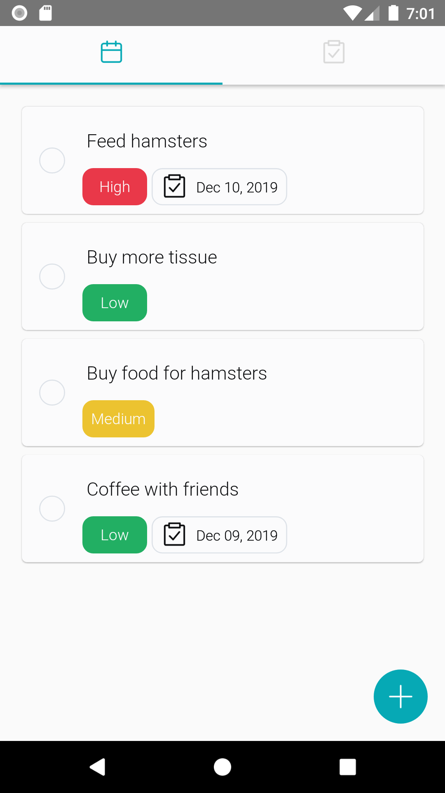
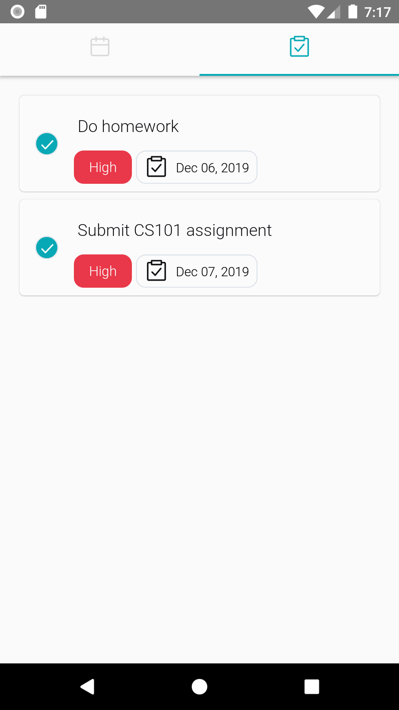
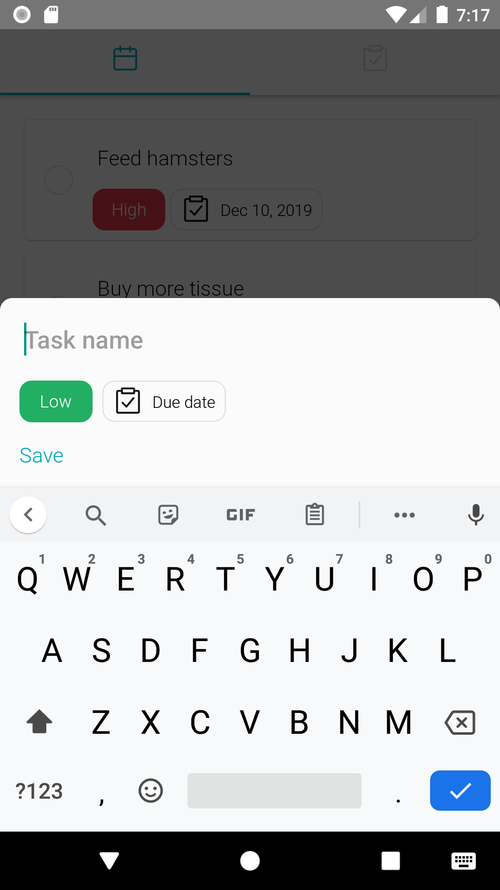
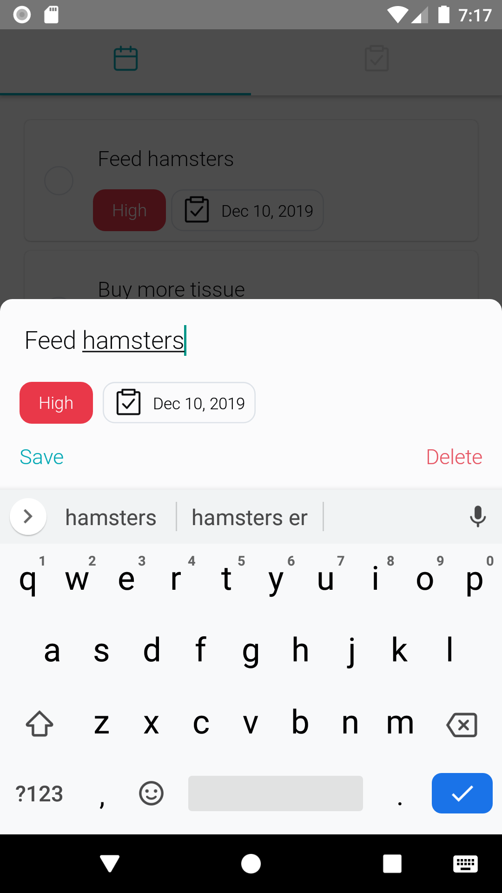

# TinderSample
## Description
Just a sample Todo-like application

## Screenshots
### Main screen
 &nbsp; 

### Actions
 &nbsp; 

## Usage
### Create task
- Press on the **Floating Button** at bottom right screen.
### Edit task
- Press on the name, priority tag, date tag of a task for quick edit.
- Press on the task to open **Edit Panel**.
### Others
- Order of priority tag while being pressed: **Low** => **Medium** => **High** and repeat.
- Long pressing on **date tag** to remove the date.

## Dependencies
All listed in package.json, some significant libraries and API can be mentioned below:react-native-deck-swiper)
### Local storage
- [redux-persist](https://github.com/rt2zz/redux-persist)
- [async-storage](https://github.com/react-native-community/async-storage)
### Navigation
- [react-navigation](https://reactnavigation.org/docs/en/getting-started.html)

## Storybook
- Using storybook to check components' behaviors.
- Storybook will replace the current application UI with Storybook UI.
  ```
  yarn storybook-android
  ```
  ```
  yarn storybook-ios
  ```

## Responsiveness
- The author did not have enough time to support for responsiveness. Try this on iPhone 11 or Nexus 5X to have the best experience

## Localize
### Languages
- English

## TODO
- Use a cloud storage service linked with Redux to store all to-do items.
- Unit tests for all components.
- Integration tests for a particular user action, for example adding a new to-do item.